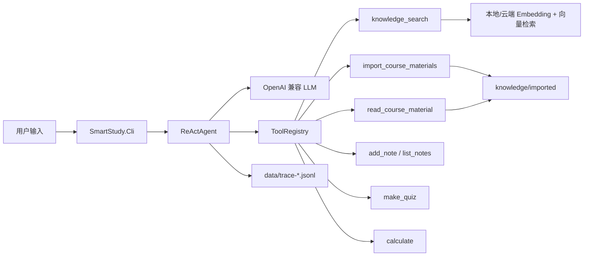

# SmartStudy - 基于 .NET 8 的智能学习助手 Agent

> 《.NET 体系结构设计与开发》期末作业  
> 主题：基于 .NET 的 AI Agent 开发  
> 选题：智能学习助手，覆盖 ReAct、工具调用、RAG、MCP、流式输出与可观测性

## 项目简介

SmartStudy 是一个使用 C# / .NET 8 实现的控制台 AI Agent。用户可以用自然语言提问课程资料、导入本地课件、查询某个 PDF 的具体内容、记录学习笔记、生成复习题或进行简单计算。

项目核心采用 ReAct 工作流：Agent 先由 LLM 判断任务意图，再决定是否调用工具，读取 Observation 后继续推理，直到给出最终回答。



## 功能覆盖

| 课程要求 | 实现说明 |
| --- | --- |
| LLM 集成 | `OpenAiLlmClient` 通过 OpenAI 兼容 Chat Completions 接口调用智谱 / DeepSeek |
| Agent 推理循环 | `ReActAgent` 实现 Thought -> Action -> Observation -> Final Answer |
| 工具调用 | 注册 7 个工具，覆盖检索、文件读取、导入、笔记、出题、计算 |
| 记忆机制 | `ConversationMemory` 保留 system prompt，并用滑动窗口管理上下文 |
| 用户界面 | `SmartStudy.Cli` 使用 Spectre.Console，支持普通模式和流式模式 |
| 异步编程 | LLM、工具、RAG、Streaming 均使用 `async/await` / `IAsyncEnumerable` |
| 错误处理 | LLM 请求、工具调用、RAG 索引均有异常捕获和可读错误返回 |
| 可观测性 | 控制台显示 Agent 过程，同时写入 JSONL trace 文件 |

## 加分项

| 加分项 | 实现 |
| --- | --- |
| Streaming | `--stream` 启用 SSE 流式输出 |
| RAG | 支持智谱 `embedding-3` 和本地 Hash Embedding 两种模式 |
| MCP | `SmartStudy.Mcp` 以 stdio 方式暴露笔记工具 |
| 单元测试 | xUnit 覆盖 Agent Loop、工具调用、RAG、本地 Embedding、流式 tool call、中文输入编辑等 |
| 本地资料读取 | 可读取 `.pdf/.pptx/.docx/.md/.txt` 并导入知识库 |

## 解决方案结构

```text
SmartStudy.sln
├── src/
│   ├── SmartStudy.Core/
│   │   ├── Agent/              ReActAgent 主循环
│   │   ├── Configuration/      AgentOptions、LLM profile 管理
│   │   ├── Llm/                OpenAI 兼容客户端与 DTO
│   │   ├── Memory/             对话记忆
│   │   ├── Rag/                Embedding、向量库、索引器、资料导入
│   │   ├── Tools/              ITool、ToolRegistry、内置工具
│   │   └── Tracing/            控制台与 JSONL 追踪
│   ├── SmartStudy.Cli/         控制台应用
│   └── SmartStudy.Mcp/         MCP stdio Server
├── tests/SmartStudy.Tests/     xUnit 测试
├── knowledge/                  初始课程知识库
├── docs/
│   ├── architecture.md         架构说明与流程图
│   └── reflection-report.md    反思报告与核心代码解读
└── README.md
```

## 内置工具

| 工具名 | 功能 | 典型触发方式 |
| --- | --- | --- |
| `knowledge_search` | 对知识库做 RAG 检索 | “解释 ReAct / Semantic Kernel / MCP” |
| `read_course_material` | 按文件名读取已导入课件的连续内容 | “详细讲讲 Lesson00 这个 PDF” |
| `import_course_materials` | 读取本地目录并导入 PDF/PPTX/DOCX/TXT/MD | “我的课程资料在某个文件夹，请阅读它们” |
| `add_note` | 保存学习笔记 | “把这个知识点记下来” |
| `list_notes` | 查询学习笔记 | “列出我的 acceptance 标签笔记” |
| `make_quiz` | 根据材料生成练习题 | “基于这段内容出 3 道选择题” |
| `calculate` | 安全四则运算 | “计算 (45+15)/6” |

## 环境要求

- .NET 8 SDK
- Windows / macOS / Linux 均可运行，当前项目已在 Windows + .NET `8.0.413` 验证
- 可选：Python + PyMuPDF，用于从 PDF 抽取文本。当前机器已验证可用
- 至少一个 OpenAI 兼容 LLM API Key

## API 配置

不要把真实 API Key 写进 `appsettings.json`。推荐在 `src/SmartStudy.Cli/appsettings.Local.json` 中配置，该文件已被 `.gitignore` 忽略。

### 方式一：使用环境变量

PowerShell 示例：

```powershell
$env:ZHIPUAI_API_KEY = "<your-zhipu-key>"
$env:DEEPSEEK_API_KEY = "<your-deepseek-key>"
```

`appsettings.json` 已内置以下 LLM profiles：

| Profile | Model | Base URL |
| --- | --- | --- |
| `glm-5.1` | `glm-5.1` | `https://open.bigmodel.cn/api/coding/paas/v4` |
| `glm-5` | `glm-5` | `https://open.bigmodel.cn/api/coding/paas/v4` |
| `glm-4.7` | `glm-4.7` | `https://open.bigmodel.cn/api/coding/paas/v4` |
| `glm-4-flash` | `glm-4-flash` | `https://open.bigmodel.cn/api/coding/paas/v4` |
| `deepseek-v4-flash` | `deepseek-v4-flash` | `https://api.deepseek.com` |
| `deepseek-v4-pro` | `deepseek-v4-pro` | `https://api.deepseek.com` |
| `deepseek-chat` | `deepseek-chat` | `https://api.deepseek.com` |

### 方式二：使用本地配置文件

`src/SmartStudy.Cli/appsettings.Local.json` 示例：

```jsonc
{
  "Agent": {
    "ActiveLlmProfile": "glm-4-flash",
    "LlmProfiles": {
      "glm-4-flash": {
        "ApiKey": "<your-zhipu-key>"
      },
      "deepseek-chat": {
        "ApiKey": "<your-deepseek-key>"
      }
    },
    "Embedding": {
      "Provider": "local",
      "LocalDimensions": 512
    }
  }
}
```

`Embedding.Provider` 可选：

| Provider | 说明 |
| --- | --- |
| `local` | 使用 `LocalHashEmbeddingClient`，不调用云端 embedding，适合演示和离线验收 |
| `zhipu` | 使用智谱 `embedding-3`，语义质量更好，但依赖网络和 API Key |

## 构建与测试

在项目根目录执行：

```powershell
dotnet restore SmartStudy.sln
dotnet build SmartStudy.sln --no-restore
dotnet test SmartStudy.sln --no-build --nologo
```

当前验收结果：

```text
Build: 0 warning, 0 error
Tests: 18/18 passed
```

## 运行 CLI

### 构建知识库索引

```powershell
dotnet run --project src\SmartStudy.Cli\SmartStudy.Cli.csproj -- index
```

### 启动交互对话

```powershell
dotnet run --project src\SmartStudy.Cli\SmartStudy.Cli.csproj -- chat
dotnet run --project src\SmartStudy.Cli\SmartStudy.Cli.csproj -- chat --stream
```

交互模式支持：

| 输入 | 行为 |
| --- | --- |
| `:q` | 退出 |
| `:reset` | 清空对话记忆 |
| `:stream` | 切换流式输出 |
| `:models` | 查看所有 LLM profiles |
| `:model <name>` | 切换当前模型，例如 `:model deepseek-chat` |

输入行支持左/右箭头、Home、End、Backspace、Delete，并已修复中文输入时光标落在半个汉字中间的问题。

### 单次提问

单次提问适合录屏、验收和自动化测试：

```powershell
dotnet run --project src\SmartStudy.Cli\SmartStudy.Cli.csproj -- ask "请用一句话解释 ReAct Agent"

dotnet run --project src\SmartStudy.Cli\SmartStudy.Cli.csproj -- ask "请计算 (45+15)/6"

dotnet run --project src\SmartStudy.Cli\SmartStudy.Cli.csproj -- ask "请详细讲讲 2026_Slides Lesson00_Introduction to SEME.pdf 的具体内容，不要省略"

dotnet run --project src\SmartStudy.Cli\SmartStudy.Cli.csproj -- ask "我的课程资料在 C:\Users\21125\Desktop\SEM & SEP\ppts，请阅读它们" --llm glm-4-flash
```

也可以在命令行直接选择模型：

```powershell
dotnet run --project src\SmartStudy.Cli\SmartStudy.Cli.csproj -- ask "测试 GLM" --llm glm-4-flash
dotnet run --project src\SmartStudy.Cli\SmartStudy.Cli.csproj -- ask "测试 DeepSeek" --llm deepseek-chat
```

## 本地课程资料工作流

用户给出本地文件夹并要求“阅读/导入资料”时，Agent 会调用 `import_course_materials`：

1. 扫描目录中的 `.pdf/.pptx/.docx/.md/.txt`
2. 抽取文本
3. 写入运行目录下的 `knowledge/imported`
4. 重建 RAG 索引
5. 后续可用 `knowledge_search` 检索，也可用 `read_course_material` 精读某个文件

示例：

```powershell
dotnet run --project src\SmartStudy.Cli\SmartStudy.Cli.csproj -- ask "我的课程资料在 C:\Users\21125\Desktop\SEM & SEP\ppts，请你阅读它们"

dotnet run --project src\SmartStudy.Cli\SmartStudy.Cli.csproj -- ask "请按页详细讲讲 2026_Slides Lesson00_Introduction to SEME.pdf"
```

注意：CLI 启动时会把工作目录切换到可执行文件目录，运行时数据通常位于：

```text
src/SmartStudy.Cli/bin/Debug/net8.0/data/
src/SmartStudy.Cli/bin/Debug/net8.0/knowledge/imported/
```

发布后则位于发布目录下的 `data/` 和 `knowledge/`。

## 可观测性

每次 Agent 运行都会输出可读过程：

```text
step 1 · Thought
Action read_course_material(...)
Observation ...
step 2 · Thought
FinalAnswer ...
```

同时写入 JSONL trace：

```text
data/trace-*.jsonl
```

这些文件可以用于答辩时展示 Agent 的真实决策链、工具调用参数和工具返回结果。

## MCP Server

启动 MCP stdio Server：

```powershell
dotnet run --project src\SmartStudy.Mcp\SmartStudy.Mcp.csproj
```

当前 MCP Server 暴露笔记能力：

| MCP 工具 | 功能 |
| --- | --- |
| `AddStudyNote` | 保存学习笔记 |
| `ListStudyNotes` | 按标签或关键字查询笔记 |

这证明同一套领域能力不仅能被 CLI 使用，也可以被外部 MCP Host 复用。

## 推荐验收脚本

```powershell
dotnet build SmartStudy.sln --no-restore
dotnet test SmartStudy.sln --no-build --nologo

dotnet run --project src\SmartStudy.Cli\SmartStudy.Cli.csproj -- index
dotnet run --project src\SmartStudy.Cli\SmartStudy.Cli.csproj -- ask "请解释 ReAct Agent 的工作流"
dotnet run --project src\SmartStudy.Cli\SmartStudy.Cli.csproj -- ask "请计算 (45+15)/6"
dotnet run --project src\SmartStudy.Cli\SmartStudy.Cli.csproj -- ask "请把 ReAct 的核心思想记成一条笔记，标签是 final"
dotnet run --project src\SmartStudy.Cli\SmartStudy.Cli.csproj -- ask "列出 final 标签的笔记"
dotnet run --project src\SmartStudy.Cli\SmartStudy.Cli.csproj -- ask "请按页详细讲讲 2026_Slides Lesson00_Introduction to SEME.pdf 的具体内容"
```

## 文档

- `docs/architecture.md`：架构说明、模块关系、ReAct 流程图
- `docs/reflection-report.md`：反思报告、关键代码解读、AI 使用透明说明

## 当前状态

- 解决方案可构建
- 单元测试 18/18 通过
- 支持 GLM / DeepSeek 模型切换
- 支持本地 RAG 与智谱 embedding
- 支持读取本地课程资料目录
- 支持精读已导入的具体课件文件
- 支持中文输入行内编辑
- 已完成真实 CLI 端到端验证
