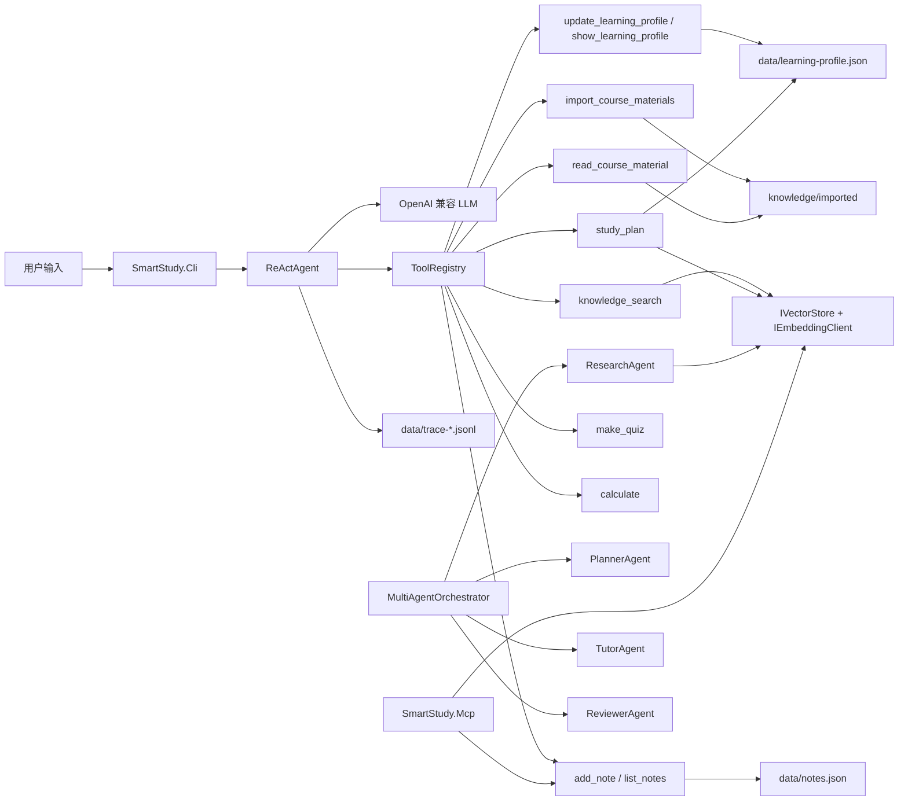

# SmartStudy 智能学习助手 Agent

> 《.NET 体系结构设计与开发》期末作业  
> 主题：基于 .NET 的 AI Agent 开发  
> 技术关键词：.NET 8、ReAct、Tool Calling、RAG、MCP、Streaming、可观测性、单元测试

## 项目简介

SmartStudy 是一个使用 C# / .NET 8 实现的控制台 AI Agent。它面向课程学习场景，支持用户用自然语言提问课程资料、导入本地课件、精读某个 PDF/PPTX/DOCX/XLSX/CSV/HTML 文件、保存学习笔记、维护长期学习画像、追踪学习进度、记录错题、生成复习计划、生成复习题、进行简单计算，并通过 ReAct 循环自主选择是否调用工具。

项目的核心目标不是只做一个“聊天壳”，而是展示一个完整 Agent 系统如何在 .NET 中组织：LLM 客户端、工具注册、记忆、RAG 检索、外部资料导入、MCP 服务端、流式输出、诊断命令和测试验收。

## 功能覆盖

| 课程要求 / 能力点 | 当前实现 |
| --- | --- |
| LLM 集成 | `OpenAiLlmClient` 通过 OpenAI 兼容接口调用智谱 GLM 和 DeepSeek |
| Agent 推理循环 | `ReActAgent` 实现 Thought -> Action -> Observation -> Final Answer 工作流 |
| Tool Calling | 当前注册 17 个自定义工具，覆盖检索、导入、文件精读、笔记、学习画像、学习进度、错题本、复习计划、出题和计算 |
| 记忆机制 | `ConversationMemory` 管理短期上下文，`JsonNoteStore` 持久化学习笔记，`JsonLearningProfileStore` 持久化长期学习画像 |
| RAG | 支持智谱 `embedding-3` 云端向量化，也支持完全离线的本地 Hash Embedding；检索结果包含来源、ChunkId、相似度和来源汇总 |
| 本地资料读取 | 支持导入 `.pdf/.pptx/.docx/.xlsx/.csv/.tsv/.html/.htm/.md/.txt` 到本地知识库 |
| 控制台 UI | `SmartStudy.Cli` 基于 Spectre.Console，支持交互模式、单次问答、诊断和工具清单 |
| Streaming | `--stream` 启用 SSE 流式输出 |
| 可观测性 | 控制台展示 Agent 步骤，并写入 `data/trace-*.jsonl` |
| Multi-Agent | `multi` / `multi-agent` 命令展示 Planner、Researcher、Tutor、Reviewer 四个 Agent 协作 |
| Plan-and-Execute + Reflection | `plan-execute` 命令先规划、再检索执行、最后用 `AnswerQualityReviewer` 做确定性质量检查 |
| MCP | `SmartStudy.Mcp` 以 stdio 暴露笔记、知识库检索和资料清单能力 |
| 单元测试 | xUnit 覆盖 Agent Loop、工具、RAG、本地 Embedding、CLI 编辑器、MCP 工具等 |

## 总体架构



## 解决方案结构

```text
SmartStudy.sln
├── src/
│   ├── SmartStudy.Core/
│   │   ├── Agent/              ReActAgent 主循环
│   │   ├── Configuration/      AgentOptions、LLM Profile 管理
│   │   ├── Llm/                OpenAI 兼容 Chat Completions 客户端
│   │   ├── Memory/             对话记忆
│   │   ├── Rag/                Embedding、向量库、索引器、资料导入
│   │   ├── Tools/              ITool、ToolRegistry、内置工具
│   │   └── Tracing/            控制台与 JSONL 追踪
│   ├── SmartStudy.Cli/         控制台应用
│   └── SmartStudy.Mcp/         MCP stdio Server
├── tests/
│   └── SmartStudy.Tests/       xUnit 单元测试
├── knowledge/                  初始课程知识库
├── resource/                   原始参考资料
├── docs/
│   ├── architecture.md         架构说明与流程图
│   ├── development-plan.md     后续迭代计划
│   ├── demo-script.md          10 分钟演示脚本与答辩 FAQ
│   ├── reflection-report.md    反思报告与核心代码解读
│   └── team-iteration-plan.md  4 人 7 天团队迭代计划
└── README.md
```

## 内置 Agent 工具

| 工具名 | 功能 | 典型触发方式 |
| --- | --- | --- |
| `knowledge_search` | 对课程知识库做 RAG 检索 | “解释 ReAct / Semantic Kernel / MCP” |
| `read_course_material` | 按文件名读取已导入课件的连续内容 | “详细讲讲 Lesson00 这个 PDF” |
| `import_course_materials` | 读取本地资料目录并导入知识库 | “我的课程资料在某个文件夹，请阅读它们” |
| `add_note` | 保存学习笔记到 JSON 文件 | “把这个知识点记下来” |
| `list_notes` | 按标签或关键词查询笔记 | “列出我关于 RAG 的笔记” |
| `update_learning_profile` | 更新薄弱项、优势项、学习目标和讲解偏好 | “我不太懂 ReAct，想准备期末答辩” |
| `show_learning_profile` | 查看长期学习画像 | “我现在的学习画像是什么” |
| `study_plan` | 基于学习画像和课程资料生成短期复习计划 | “给我做一个 3 天复习计划” |
| `add_study_task` | 添加可追踪的学习任务 | “把复习 ReAct 加入学习任务” |
| `mark_task_done` | 标记学习任务完成并记录复盘 | “我完成了 ReAct 复习，用了 35 分钟” |
| `show_progress` | 查看学习进度、完成率和待办任务 | “查看我的学习进度” |
| `review_history` | 查看最近学习历史和复盘记录 | “回顾最近学了什么” |
| `make_quiz` | 基于材料生成练习题，隐藏答案，并校验 / 修复 JSON 结构 | “基于这段内容出 3 道选择题” |
| `submit_quiz_answer` | 提交练习答案，自动判分并给解析 | “第 1 题我选 B” |
| `record_quiz_result` | 手动记录答题结果，答错时自动更新薄弱项 | “记录这道 ReAct 题我答错了” |
| `show_mistakes` | 查看错题本和答题正确率 | “查看我的错题本” |
| `calculate` | 安全计算简单数学表达式 | “计算 (45+15)/6” |

## 环境要求

- .NET 8 SDK
- Windows / macOS / Linux 均可运行
- 可选：Python + PyMuPDF，用于提升 PDF 文本抽取效果
- 至少一个 OpenAI 兼容 LLM API Key

当前项目已在 Windows + .NET `8.0.413` 环境中完成构建和测试验收。

## API 与模型配置

项目已经在 `src/SmartStudy.Cli/appsettings.json` 中预置多个 LLM profile。请不要把真实 API Key 写入仓库文件，推荐使用环境变量或本地配置文件。

### 已支持的 LLM Profiles

| Profile | Model | Base URL | Max Tokens | Key 环境变量 |
| --- | --- | --- | --- | --- |
| `glm-5.1` | `glm-5.1` | `https://open.bigmodel.cn/api/coding/paas/v4` | 8192 | `ZHIPUAI_API_KEY` |
| `glm-5` | `glm-5` | `https://open.bigmodel.cn/api/coding/paas/v4` | 4096 | `ZHIPUAI_API_KEY` |
| `glm-4.7` | `glm-4.7` | `https://open.bigmodel.cn/api/coding/paas/v4` | 4096 | `ZHIPUAI_API_KEY` |
| `glm-4-flash` | `glm-4-flash` | `https://open.bigmodel.cn/api/coding/paas/v4` | 4096 | `ZHIPUAI_API_KEY` |
| `deepseek-v4-flash` | `deepseek-v4-flash` | `https://api.deepseek.com` | 4096 | `DEEPSEEK_API_KEY` |
| `deepseek-v4-pro` | `deepseek-v4-pro` | `https://api.deepseek.com` | 8192 | `DEEPSEEK_API_KEY` |
| `deepseek-chat` | `deepseek-chat` | `https://api.deepseek.com` | 4096 | `DEEPSEEK_API_KEY` |

### Embedding 配置

| Provider | Model | Base URL | 说明 |
| --- | --- | --- | --- |
| `local` | `local-hash` | 不需要网络 | 完全离线，适合演示和无网络验收 |
| `zhipu` | `embedding-3` | `https://open.bigmodel.cn/api/paas/v4` | 语义质量更好，需要智谱 API Key |

### 方式一：使用环境变量

PowerShell 示例：

```powershell
$env:ZHIPUAI_API_KEY = "<your-zhipu-key>"
$env:DEEPSEEK_API_KEY = "<your-deepseek-key>"
$env:SMARTSTUDY_Agent__Embedding__ApiKey = "<your-zhipu-key>"
```

如果希望强制使用本地 RAG，不调用云端 embedding：

```powershell
$env:SMARTSTUDY_Agent__Embedding__Provider = "local"
```

### 方式二：使用本地配置文件

新建 `src/SmartStudy.Cli/appsettings.Local.json`。该文件已被 `.gitignore` 忽略，适合保存本机私有配置。

```jsonc
{
  "Agent": {
    "ActiveLlmProfile": "glm-4-flash",
    "LlmProfiles": {
      "glm-4-flash": {
        "ApiKey": "<your-zhipu-key>"
      },
      "deepseek-chat": {
        "ApiKey": "<your-deepseek-key>"
      }
    },
    "Embedding": {
      "Provider": "local",
      "ApiKey": "<your-zhipu-key>",
      "LocalDimensions": 512
    }
  }
}
```

> 说明：`Embedding.Provider = "local"` 时不会调用云端 embedding，`ApiKey` 可留空。  
> 如果切换为 `zhipu`，请配置 `Agent:Embedding:ApiKey`。

## 构建与测试

在项目根目录执行：

```powershell
dotnet restore SmartStudy.sln
dotnet build SmartStudy.sln --no-restore
dotnet test SmartStudy.sln --no-build --nologo
```

最近一次完整验收结果：

```text
Build: 0 warning, 0 error
Tests: 41/41 passed
```

## 运行 CLI

### 诊断项目状态

答辩或录屏前建议先运行：

```powershell
dotnet run --project src\SmartStudy.Cli\SmartStudy.Cli.csproj -- doctor
dotnet run --project src\SmartStudy.Cli\SmartStudy.Cli.csproj -- status
dotnet run --project src\SmartStudy.Cli\SmartStudy.Cli.csproj -- tools
```

`doctor` / `status` 会显示当前 LLM profile、Embedding provider、知识库目录、RAG 索引、笔记文件、学习画像文件和工具注册状态。`tools` 会列出所有 Agent 工具。

### 构建知识库索引

```powershell
dotnet run --project src\SmartStudy.Cli\SmartStudy.Cli.csproj -- index
```

如果使用本地 RAG，可以先设置：

```powershell
$env:SMARTSTUDY_Agent__Embedding__Provider = "local"
dotnet run --project src\SmartStudy.Cli\SmartStudy.Cli.csproj -- index
```

### 启动交互对话

```powershell
dotnet run --project src\SmartStudy.Cli\SmartStudy.Cli.csproj -- chat
dotnet run --project src\SmartStudy.Cli\SmartStudy.Cli.csproj -- chat --stream
```

交互模式支持以下指令：

启动时只展示常用指令：`:q`、`:stream`、`:multi <目标>`、`:help`。输入 `:help` 或 `:commands` 可查看完整冒号指令表。

| 输入 | 行为 |
| --- | --- |
| `:q` | 退出 |
| `:help` / `:commands` | 显示全部冒号指令 |
| `:reset` | 清空对话记忆 |
| `:stream` | 切换流式输出 |
| `:models` | 查看所有 LLM profiles |
| `:model <name>` | 切换当前模型，例如 `:model deepseek-chat` |
| `:multi <goal>` | 在聊天模式中启动 Multi-Agent 协作，例如 `:multi 解释 ReAct Agent 并准备答辩` |
| `:plan-execute <goal>` | 在聊天模式中启动 Plan-and-Execute，并在最终输出前做质量检查 |

聊天模式还支持一组工具快捷指令。这些指令和自然语言触发的 Tool Calling 共用同一套 `ITool` 实现，只是把工具调用显式交给用户控制，适合演示和验收。

| 输入 | 等价工具 | 示例 |
| --- | --- | --- |
| `:search <query>` | `knowledge_search` | `:search ReAct Agent` |
| `:read <file> [start-end]` | `read_course_material` | `:read Lesson00 1-3` |
| `:note <title> \| <content> \| <tags>` | `add_note` | `:note ReAct \| Thought Action Observation \| final,agent` |
| `:notes [#tag-or-keyword]` | `list_notes` | `:notes #final` |
| `:profile` | `show_learning_profile` | `:profile` |
| `:plan <goal>` | `study_plan` | `:plan 3 天复习 Agent 项目` |
| `:quiz <material> \| <count>` | `make_quiz` | `:quiz ReAct 包含 Thought、Action、Observation \| 2` |
| `:answer <quizId> \| <题号> \| <答案> \| <主题>` | `submit_quiz_answer` | `:answer latest \| 1 \| B \| ReAct` |
| `:calc <expression>` | `calculate` | `:calc (45+15)/6` |
| `:import <directory> \| <glob>` | `import_course_materials` | `:import C:\Course\PPT \| Lesson00` |

控制台输入行支持左 / 右箭头、Home、End、Backspace、Delete，并已处理中文全角字符光标移动问题。

### 单次提问

单次提问适合自动化验收和录屏：

```powershell
dotnet run --project src\SmartStudy.Cli\SmartStudy.Cli.csproj -- ask "请用一句话解释 ReAct Agent"

dotnet run --project src\SmartStudy.Cli\SmartStudy.Cli.csproj -- ask "请计算 (45+15)/6"

dotnet run --project src\SmartStudy.Cli\SmartStudy.Cli.csproj -- ask "请检索课程资料，并解释 Semantic Kernel 的核心思想"

dotnet run --project src\SmartStudy.Cli\SmartStudy.Cli.csproj -- ask "我对 ReAct 和 RAG 比较薄弱，目标是准备期末答辩，请更新我的学习画像"

dotnet run --project src\SmartStudy.Cli\SmartStudy.Cli.csproj -- ask "请基于我的学习画像制定一个 3 天复习计划"

dotnet run --project src\SmartStudy.Cli\SmartStudy.Cli.csproj -- ask "请详细讲讲 2026_Slides Lesson00_Introduction to SEME.pdf 的具体内容，不要省略"
```

也可以在命令行直接选择模型：

```powershell
dotnet run --project src\SmartStudy.Cli\SmartStudy.Cli.csproj -- ask "测试 GLM 是否连通" --llm glm-4-flash
dotnet run --project src\SmartStudy.Cli\SmartStudy.Cli.csproj -- ask "测试 DeepSeek 是否连通" --llm deepseek-chat
```

### Multi-Agent 协作演示

`multi` / `multi-agent` 命令用于展示多个专业 Agent 分工协作完成同一个学习目标：

```powershell
dotnet run --project src\SmartStudy.Cli\SmartStudy.Cli.csproj -- multi "解释 ReAct Agent 并准备答辩"
```

也可以先进入流式聊天，再用交互命令触发同一套协作流程：

```powershell
dotnet run --project src\SmartStudy.Cli\SmartStudy.Cli.csproj -- chat --stream
```

进入聊天后输入：

```text
:multi 解释 ReAct Agent 并准备答辩
```

当前协作链路：

| Agent | 职责 | 前端展示 |
| --- | --- | --- |
| `PlannerAgent` | 拆解用户目标，决定后续执行顺序 | 控制台表格中的计划摘要 |
| `ResearchAgent` | 调用 RAG 检索课程知识库，提供资料依据 | 控制台表格中的检索结果摘要 |
| `TutorAgent` | 结合计划、资料和学习画像生成学习答复 | 控制台表格摘要 + Final Answer 面板 |
| `ReviewerAgent` | 检查是否覆盖目标、是否使用资料、是否包含下一步 | `Reviewer: PASS` 或 `NEEDS ATTENTION` 状态 |

验收标准：

1. 命令能够正常运行并显示 `SmartStudy Multi-Agent 协作` 标题。
2. 前端表格中必须出现 `PlannerAgent`、`ResearchAgent`、`TutorAgent`、`ReviewerAgent` 四行。
3. `ResearchAgent` 输出应包含课程资料来源或明确提示索引缺失。
4. `ReviewerAgent` 在资料可用时应显示 `PASS`，并在最终面板给出结构化答复。
5. 单元测试中 `MultiAgentOrchestratorTests` 应通过，证明角色顺序和审核逻辑稳定。

### Plan-and-Execute 与答案质量检查

`plan-execute` / `plan-and-execute` 命令用于展示“先规划、再执行、最后审查”的 Agent 架构模式。它不会直接把问题丢给模型，而是把任务拆成 Plan、Execute: RAG 检索、Execute: 生成答复、Review: 答案质量检查四步。

```powershell
$env:SMARTSTUDY_Agent__Embedding__Provider = "local"
dotnet run --no-build --project src\SmartStudy.Cli\SmartStudy.Cli.csproj -- plan-execute "解释 ReAct Agent"
```

也可以在聊天模式输入：

```text
:plan-execute 解释 ReAct Agent
```

验收标准：

1. 控制台显示 `SmartStudy Plan-and-Execute` 标题。
2. 表格中出现 `Plan`、`Execute: RAG 检索`、`Execute: 生成答复`、`Review: 答案质量检查` 四行。
3. RAG 可用时，检索步骤状态为 `OK`，输出中包含 `来源`、`证据编号`、`ChunkId` 和相似度。
4. 最终显示 `Quality Review: PASS`，质量检查项包括非空回答、回答充分、覆盖用户目标、包含资料依据、包含下一步、无明显占位文本。
5. 如果网络或云端 embedding 不可用，检索步骤会降级为 `WARN` 并展示 `检索失败`，程序不会崩溃。

本次实测运行效果：

```text
SmartStudy Plan-and-Execute
Step: Plan                 OK
Step: Execute: RAG 检索    OK
Step: Execute: 生成答复    OK
Step: Review: 答案质量检查 OK
Quality Review: PASS
```

## 本地课程资料工作流

当用户给出本地文件夹并要求“阅读 / 导入课程资料”时，Agent 应调用 `import_course_materials`，而不是回答“无法访问文件”。工具会完成以下步骤：

1. 扫描目录中的 `.pdf/.pptx/.docx/.xlsx/.csv/.tsv/.html/.htm/.md/.txt`
2. 抽取文本
3. 写入运行目录下的 `knowledge/imported`
4. 重建 RAG 索引
5. 后续可用 `knowledge_search` 检索，也可用 `read_course_material` 精读某个文件

示例：

```powershell
dotnet run --project src\SmartStudy.Cli\SmartStudy.Cli.csproj -- ask "我的课程资料在 C:\Users\21125\Desktop\SEM & SEP\ppts，请你阅读它们"

dotnet run --project src\SmartStudy.Cli\SmartStudy.Cli.csproj -- ask "请按页详细讲讲 2026_Slides Lesson00_Introduction to SEME.pdf"
```

扩展格式验收标准：

1. `.csv/.tsv` 会按行抽取表格内容，并用 `|` 连接单元格。
2. `.html/.htm` 会移除标签、script/style，并保留可读正文。
3. `.xlsx` 会读取工作表名称、共享字符串和单元格文本，不需要额外 NuGet 包。
4. 导入成功后，`knowledge/imported` 中生成对应 `.md` 文件，并自动重建 RAG 索引。
5. 单元测试 `CourseMaterialImporterExtendedFormatTests.ImportsCsvHtmlAndXlsxMaterials` 通过。

注意：CLI 启动时会把工作目录切换到可执行文件目录。因此 `dotnet run` 调试时，运行数据通常位于：

```text
src/SmartStudy.Cli/bin/Debug/net8.0/data/
src/SmartStudy.Cli/bin/Debug/net8.0/knowledge/imported/
```

发布运行后，数据位于发布目录下的 `data/` 和 `knowledge/`。其中学习笔记保存为 `data/notes.json`，长期学习画像保存为 `data/learning-profile.json`。

## 运行 Blazor Web 前端

Web 前端位于 `src/SmartStudy.Web`，提供 Agent 对话、工具时间线、知识库状态、工具清单和最近笔记面板。

在项目根目录启动：

```powershell
dotnet run --project src\SmartStudy.Web\SmartStudy.Web.csproj --urls http://localhost:5178
```

启动后浏览器打开：

```text
http://localhost:5178
```

如果已经构建过，可以用 `--no-build` 快速启动：

```powershell
dotnet run --no-build --project src\SmartStudy.Web\SmartStudy.Web.csproj --urls http://localhost:5178
```

如果 `5178` 端口被占用，可以换一个端口：

```powershell
dotnet run --project src\SmartStudy.Web\SmartStudy.Web.csproj --urls http://localhost:5188
```

## MCP Server

启动 MCP stdio Server：

```powershell
dotnet run --project src\SmartStudy.Mcp\SmartStudy.Mcp.csproj
```

当前 MCP Server 暴露以下能力：

| MCP 工具 | 功能 |
| --- | --- |
| `AddStudyNote` | 保存一条学习笔记并返回笔记 Id |
| `ListStudyNotes` | 按标签或关键字检索笔记 |
| `SearchKnowledge` | 在 SmartStudy 课程知识库中按语义检索相关片段 |
| `ListImportedMaterials` | 列出已经导入知识库的课程资料文件 |

这说明同一套学习助手能力不仅能被 CLI 使用，也可以通过 MCP 交给外部 Host 调用。

## 可观测性

每次 Agent 运行时，控制台会显示可读步骤，例如：

```text
step 1 · Thought
Action knowledge_search(...)
Observation ...
step 2 · Thought
FinalAnswer ...
```

同时会写入 JSONL trace：

```text
data/trace-*.jsonl
```

这些追踪文件可以用于答辩时展示 Agent 的真实决策链、工具调用参数和工具返回结果。

## 新增扩展验收：进度、错题与来源

### 学习进度追踪

验收标准：

1. `tools` 能看到 `add_study_task`、`mark_task_done`、`show_progress`、`review_history`。
2. 添加任务后会写入 `data/study-progress.json`。
3. 标记完成后，`show_progress` 显示完成率和累计学习时长，`review_history` 显示复盘记录。

命令行展示：

```powershell
dotnet run --no-build --project src\SmartStudy.Cli\SmartStudy.Cli.csproj -- chat
```

进入聊天后输入：

```text
:task 复习 ReAct 循环 | ReAct | 40
:done ReAct | 能解释 Thought Action Observation | 35
:progress
:history 5
```

### 错题本与测验反馈

验收标准：

1. `tools` 能看到 `make_quiz`、`submit_quiz_answer`、`record_quiz_result` 和 `show_mistakes`。
2. `make_quiz` 只展示题目和选项，不展示正确答案或解析，并把答案保存到 `data/quiz-sessions.json`。
3. `submit_quiz_answer` 根据题号和用户答案判分，判分后才展示标准答案和解析。
4. 答错且提供 `topic` 时，会自动把该主题写入 `data/learning-profile.json` 的薄弱项。
5. `show_mistakes` 能显示正确率、题目、用户答案、标准答案和解析。

命令行展示：

```text
:mistake ReAct 的 Observation 是什么？ | ReAct | 模型思考 | 工具返回结果 | Observation 是工具执行后的返回结果
:quiz ReAct 包含 Thought、Action、Observation | 1
:answer latest | 1 | A | ReAct
:mistakes
:profile
```

### 资料引用与来源标注

验收标准：

1. `knowledge_search` 输出包含 `来源`、`证据编号`、`ChunkId`、`相似度`。
2. 输出末尾包含 `来源汇总`，便于答辩说明回答依据。
3. `dotnet test` 中 `KnowledgeSearchServiceTests.SearchServiceFormatsRankedResults` 通过。

命令行展示：

```text
:search ReAct Agent 工具调用
```

## 推荐验收流程

```powershell
dotnet build SmartStudy.sln --no-restore
dotnet test SmartStudy.sln --no-build --nologo

dotnet run --project src\SmartStudy.Cli\SmartStudy.Cli.csproj -- doctor
dotnet run --project src\SmartStudy.Cli\SmartStudy.Cli.csproj -- tools
dotnet run --project src\SmartStudy.Cli\SmartStudy.Cli.csproj -- index

dotnet run --project src\SmartStudy.Cli\SmartStudy.Cli.csproj -- ask "请解释 ReAct Agent 的工作流"
dotnet run --project src\SmartStudy.Cli\SmartStudy.Cli.csproj -- ask "请计算 (45+15)/6"
dotnet run --project src\SmartStudy.Cli\SmartStudy.Cli.csproj -- ask "请把 ReAct 的核心思想记成一条笔记，标签是 final"
dotnet run --project src\SmartStudy.Cli\SmartStudy.Cli.csproj -- ask "列出 final 标签的笔记"
dotnet run --project src\SmartStudy.Cli\SmartStudy.Cli.csproj -- ask "我对 ReAct 和 MCP 比较薄弱，目标是完成期末答辩，请更新我的学习画像"
dotnet run --project src\SmartStudy.Cli\SmartStudy.Cli.csproj -- ask "请基于我的学习画像制定一个 3 天复习计划"
dotnet run --project src\SmartStudy.Cli\SmartStudy.Cli.csproj -- ask "请按页详细讲讲 2026_Slides Lesson00_Introduction to SEME.pdf 的具体内容"
dotnet run --project src\SmartStudy.Cli\SmartStudy.Cli.csproj -- multi "解释 ReAct Agent 并准备答辩"
$env:SMARTSTUDY_Agent__Embedding__Provider = "local"
dotnet run --no-build --project src\SmartStudy.Cli\SmartStudy.Cli.csproj -- plan-execute "解释 ReAct Agent"
```

## 当前状态

- 解决方案可构建
- 单元测试 41/41 通过
- 支持 17 个 Agent 工具
- 支持 GLM / DeepSeek 自定义切换
- 支持本地 RAG 与智谱 `embedding-3`
- 支持 Multi-Agent 协作演示：PlannerAgent、ResearchAgent、TutorAgent、ReviewerAgent
- 支持 Plan-and-Execute 架构演示和答案质量检查
- 支持读取和导入本地课程资料，包括 PDF、PPTX、DOCX、XLSX、CSV、TSV、HTML、Markdown 和 TXT
- 支持精读已导入的具体课件文件
- 支持长期学习画像和个性化复习计划
- 支持结构化练习题 JSON 校验与失败修复
- 支持中文输入行内编辑
- 支持 `doctor` / `status` / `tools` 健康检查与工具清单命令
- MCP Server 已暴露笔记、知识库检索和导入资料清单能力

## 相关文档

- `docs/architecture.md`：架构说明、模块关系、ReAct 流程图
- `docs/development-plan.md`：基于作业要求的后续开发计划与迭代路线
- `docs/demo-script.md`：10 分钟演示脚本、验收命令和常见答辩问题答案
- `docs/reflection-report.md`：反思报告、关键代码解读、答辩说明
- `docs/team-iteration-plan.md`：4 人 7 天团队分工、协作节奏和最终交付清单

## 安全说明

- 不要把真实 API Key 写进 `appsettings.json`、README 或提交记录。
- 本地私有配置建议放在 `src/SmartStudy.Cli/appsettings.Local.json`。
- `.gitignore` 已忽略 `appsettings.Local.json`、`data/`、`bin/`、`obj/` 等运行时文件。


