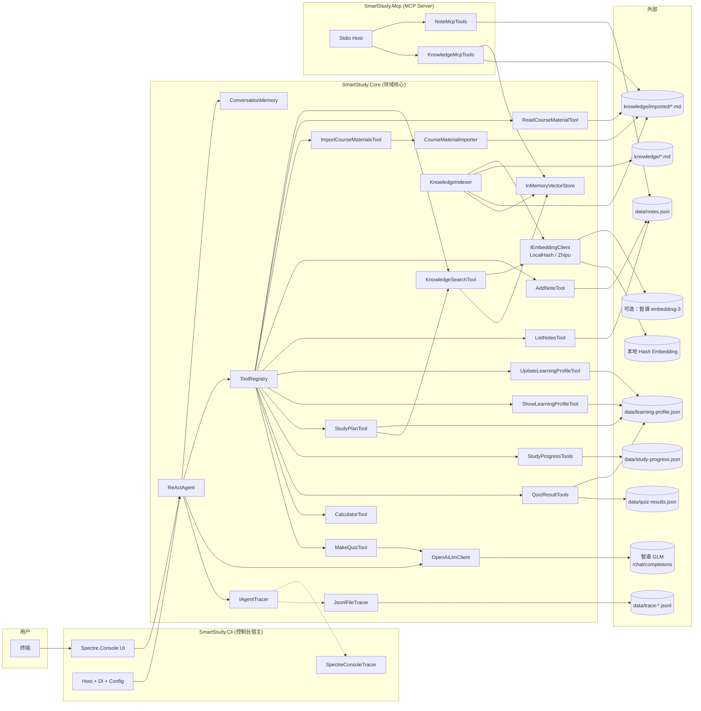
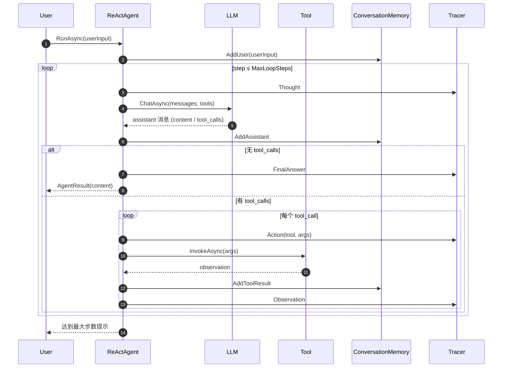
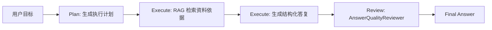

# SmartStudy 架构设计文档

## 1. 系统总览

SmartStudy 采用 **领域核心 + 适配层** 的 Clean Architecture 风格。
所有 LLM、工具、记忆、检索、追踪相关的"业务"集中在 `SmartStudy.Core`，
两个可执行项目（CLI 与 MCP Server）只是不同的"宿主"。



## 2. ReAct 推理流程



## 3. 关键设计决策

### 3.1 为什么直接 HTTP 调 OpenAI 兼容协议而不是 Semantic Kernel？

* **可教学性**：手写循环能在答辩时一行一行解释，符合评分细则 4.3 "逐行解读核心代码"。
* **可移植性**：任何兼容端点（智谱 / DeepSeek / OpenAI / Ollama）改 `BaseUrl` 即可，无须额外 connector。
* **避免框架黑盒**：SK 的 `AgentChat`、`FunctionCallingStepwisePlanner` 隐藏了 tool-loop 细节，
  不利于本课程要求的"理解 Agent 内部工作原理"。

### 3.2 为什么记忆做成接口 + 单文件实现？

* 满足 SOLID 中 DSP 与 OCP：未来若要换 SQLite / 向量检索做长期记忆，只需新增实现。
* 单元测试可直接构造 `ConversationMemory` 替代真实存储。

### 3.3 工具如何被 LLM "看见"？

每个 `ITool` 暴露三件事：`Name`、`Description`、`ParametersSchema (JSON Schema)`。
`ToolRegistry.ToOpenAiDefinitions()` 把它们打包成 OpenAI Function Calling 期望的：

```json
{
  "type": "function",
  "function": { "name": "...", "description": "...", "parameters": { /* JSON Schema */ } }
}
```

LLM 看到这些定义后，会在 `tool_calls` 字段里告诉 Agent "调用 calculate({expression:'2+3'})"。
Agent 用 `ToolRegistry.TryGet` 找到对应的 C# 工具，把结果以 `role=tool, tool_call_id=xxx` 灌回历史。

### 3.4 RAG 为什么用内存向量库？

* 课程演示规模 < 1000 个 chunk，余弦相似度 O(N·D) 完全够用，**零外部依赖**（不用 Docker / Qdrant）。
* 索引序列化为 JSON 写盘，下次启动直接 `LoadIfExistsAsync` 复用。
* 接口 `IVectorStore` 仍然抽象，未来切到 Qdrant 仅替换实现。

### 3.5 为什么支持本地 Embedding？

云端 embedding 质量更好，但现场演示可能受余额、网络、限流影响。项目通过 `Embedding.Provider` 支持两种模式：

| Provider | 实现 | 特点 |
| --- | --- | --- |
| `local` | `LocalHashEmbeddingClient` | 完全离线，基于中英文 token 哈希生成固定维度向量，适合课程资料小规模演示 |
| `zhipu` | `ZhipuEmbeddingClient` | 调用智谱 `embedding-3`，语义质量更好，但依赖 API Key 和资源额度 |

这样 RAG 的“索引、向量库、检索工具”仍然是同一套代码，只替换向量生成来源。

### 3.6 流式与可观测性如何同时存在？

* `IAgentTracer` 是单一事件总线，事件类型枚举 `Thought / Action / Observation / FinalAnswer / StreamDelta / Error`。
* `CompositeAgentTracer` 把同一事件多播到 Spectre 控制台和 JSONL 文件。
* 流式模式下，Agent 主循环改用 `IAsyncEnumerable<AgentEvent>`，
  把 `StreamDelta` 实时 yield 出去，CLI 直接 `await foreach` 渲染。

## 4. 工具一览

| Name               | 描述                            | 调用时机                | 关键文件                       |
| ------------------ | ----------------------------- | ------------------- | -------------------------- |
| `knowledge_search` | RAG 检索课程资料                    | 回答事实性问题之前           | `KnowledgeSearchTool.cs`   |
| `read_course_material` | 读取已导入课件的连续页面或整份内容       | 用户点名某个 PDF/PPT/课件并要求讲解 | `ReadCourseMaterialTool.cs` |
| `import_course_materials` | 导入本地 PDF/PPTX/DOCX/XLSX/CSV/TSV/HTML/TXT/MD 资料并重建索引 | 用户提供本地资料目录 | `ImportCourseMaterialsTool.cs` |
| `add_note`         | 把要点持久化为 JSON 笔记               | 用户说"记一下""保存"        | `NoteTools.cs`             |
| `list_notes`       | 按标签 / 关键字查询笔记                 | 用户问"我之前记了什么"        | `NoteTools.cs`             |
| `update_learning_profile` | 更新长期学习画像中的薄弱项、优势项、目标和偏好 | 用户表达不会什么、想准备什么、偏好怎么学 | `LearningProfileTools.cs` |
| `show_learning_profile` | 查看当前长期学习画像 | 用户问"我的学习画像/薄弱点是什么" | `LearningProfileTools.cs` |
| `study_plan` | 根据学习画像和课程资料生成短期复习计划 | 用户要求复习计划、备考路线、学习安排 | `LearningProfileTools.cs` |
| `add_study_task` | 添加可追踪学习任务 | 用户要求安排或记录待办学习任务 | `StudyProgressTools.cs` |
| `mark_task_done` | 标记学习任务完成并记录复盘 | 用户说完成某个学习任务或今天学完某主题 | `StudyProgressTools.cs` |
| `show_progress` | 查看任务完成率、累计时长和待办 | 用户询问学习进度或完成情况 | `StudyProgressTools.cs` |
| `review_history` | 查看最近学习历史和复盘记录 | 用户要求回顾最近学了什么 | `StudyProgressTools.cs` |
| `submit_quiz_answer` | 提交练习答案，自动判分并给解析 | 用户回答 make_quiz 生成的题目 | `QuizResultTools.cs` |
| `record_quiz_result` | 手动记录练习题答题结果，错题自动写入薄弱项 | 用户要求记录已有错题 | `QuizResultTools.cs` |
| `show_mistakes` | 查看错题本和答题正确率 | 用户要求查看错题或复盘练习 | `QuizResultTools.cs` |
| `calculate`        | 安全表达式求值（`DataTable.Compute`） | 学习时长 / 复习天数等计算      | `CalculatorTool.cs`        |
| `make_quiz`        | 二次调用 LLM 生成结构化练习题，隐藏答案，并做 JSON 校验与修复 | 用户说"出几道题""帮我复习"     | `MakeQuizTool.cs`          |

## 5. 失败模式与防御

| 风险             | 处理                                                                          |
| -------------- | --------------------------------------------------------------------------- |
| LLM 返回非法 JSON   | `JsonDocument.Parse` 包 `try/catch`，把错误写回 observation 让 LLM 自纠            |
| 工具自身抛异常        | `try/catch` 把异常文本作为 observation，循环继续                                  |
| 死循环 / 无意义反复调工具 | `MaxLoopSteps` 硬上限 + `AgentResult.ReachedLimit` 标志                       |

## 6. Plan-and-Execute 与质量检查

除了默认的 `ReActAgent` 和演示用 `MultiAgentOrchestrator`，项目还提供 `PlanExecuteAgent`，用于展示 PDF 中提到的 Plan-and-Execute 架构模式。它的流程是：



`AnswerQualityReviewer` 是确定性规则检查器，不额外调用 LLM。它检查六项内容：

| 检查项 | 目的 |
| --- | --- |
| 非空回答 | 防止空输出 |
| 回答充分 | 防止过短回答 |
| 覆盖用户目标 | 检查目标关键词是否被回应 |
| 包含资料依据 | 确认回答带有来源、证据编号或 ChunkId |
| 包含下一步 | 让答复可执行、可验收 |
| 无明显占位文本 | 防止出现“此处省略”“TODO”等交付痕迹 |

运行入口：

```powershell
dotnet run --no-build --project src\SmartStudy.Cli\SmartStudy.Cli.csproj -- plan-execute "解释 ReAct Agent"
```

验收时应看到 `Plan`、`Execute: RAG 检索`、`Execute: 生成答复`、`Review: 答案质量检查` 四个步骤，以及 `Quality Review: PASS`。如果 RAG 检索因为网络或云端 embedding 失败，检索步骤会显示 `WARN`，最终答复仍会给出失败原因而不是让程序崩溃。

## 7. 资料导入格式扩展

`CourseMaterialImporter` 的支持格式已经扩展为：

```text
.pdf, .pptx, .docx, .xlsx, .csv, .tsv, .html, .htm, .md, .txt
```

其中：

- `.csv/.tsv` 使用轻量级分隔符解析，保留表格行和单元格文本。
- `.html/.htm` 移除标签、script/style，并做 HTML decode。
- `.xlsx` 直接读取 OpenXML zip 结构中的 workbook、worksheet 和 sharedStrings，不引入额外 NuGet 包。
- `.pptx/.docx` 继续使用 OpenXML 文本节点抽取。
- `.pdf` 继续使用 Python/PyMuPDF 路径，失败时该文件会被跳过并计入 skipped。
| 上下文过长          | `ConversationMemory` 滑动窗口保留最近 N 条非 system 消息                          |
| 练习题 JSON 不合法   | `MakeQuizTool` 提取 fenced JSON / 数组片段，校验字段，失败时自动请求 LLM 修复一次       |
| 长期偏好丢失         | `JsonLearningProfileStore` 把薄弱项、优势项、目标和讲解偏好写入 `learning-profile.json` |
| 网络瞬时失败         | `HttpClient` 由 `IHttpClientFactory` 管理，CLI 层 `try/catch` 捕获并友好提示       |
| API Key 泄漏       | 通过 `appsettings.Local.json` 或环境变量注入；示例配置中 `ApiKey` 留空                  |


